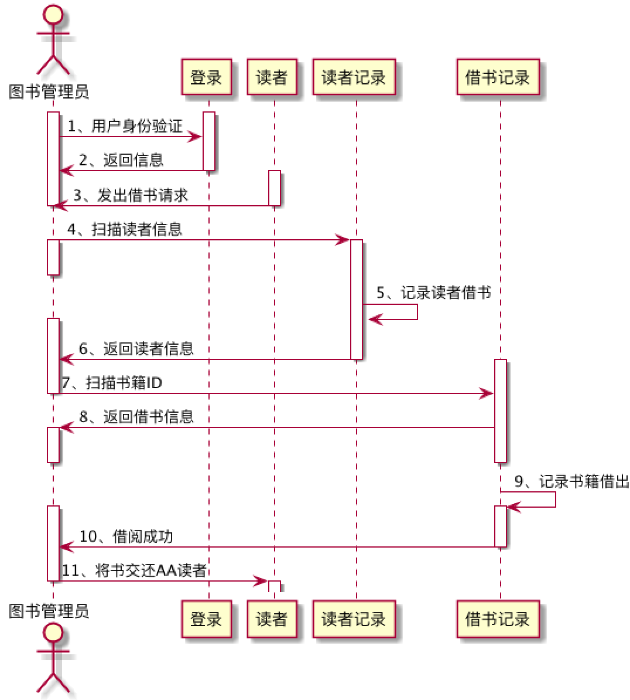
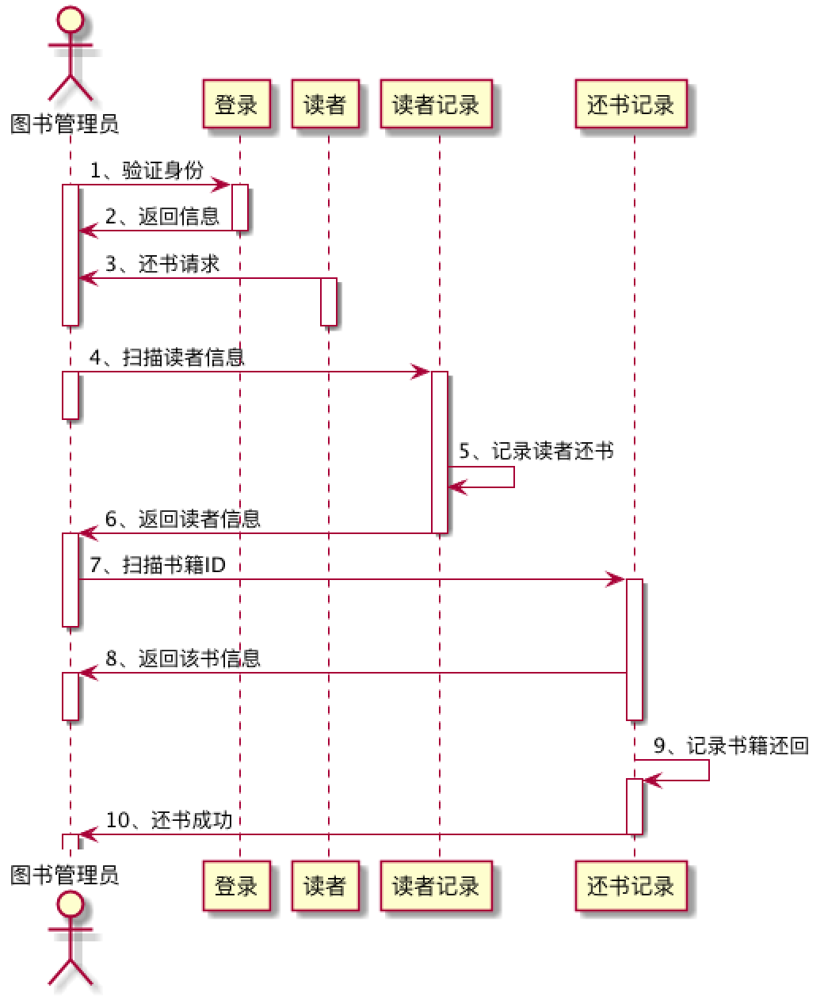

# 实验4：图书管理系统顺序图绘制
|学号|班级|姓名|
|:-------:|:-------------: | :----------:|
|201510414226|软工15-2|张嘉欣|

## 图书管理系统的顺序图

## 1. 借书用例
## 1.1. 借书用例PlantUML源码

```
@startuml
actor 图书管理员
activate 图书管理员
activate 登录
图书管理员 -> 登录 :1、用户身份验证
登录 -> 图书管理员 :2、返回信息
deactivate 登录
activate 读者
读者 -> 图书管理员 :3、发出借书请求
deactivate 读者
deactivate 图书管理员
图书管理员 -> 读者记录 :4、扫描读者信息
activate 图书管理员
deactivate 图书管理员
activate 读者记录
读者记录 -> 读者记录 : 5、记录读者借书
activate 图书管理员
读者记录 -> 图书管理员 :6、返回读者信息
deactivate 读者记录
activate 借书记录
图书管理员 -> 借书记录 :7、扫描书籍ID
deactivate 图书管理员
借书记录 -> 图书管理员 :8、返回借书信息
activate 图书管理员
deactivate 图书管理员
deactivate 借书记录
借书记录 -> 借书记录 :9、记录书籍借出状态
activate 借书记录
activate 图书管理员
借书记录 -> 图书管理员 : 10、借阅成功
deactivate 借书记录
图书管理员 -> 读者 :11、将书交还AA读者
deactivate 图书管理员
activate 读者
deactivate 读者
@enduml
```

## 1.2. 借书用例顺序图


## 1.3. 借书用例顺序图说明
读者借书需要把帐号交给图书管理员，然后图书管理员找到读者要借阅的书籍，并交给读者。管理员还需要记录读者记录和借书记录。

***

## 2. 还书用例
## 2.1. 还书用例PlantUML源码

```
@startuml
actor 图书管理员
图书管理员 -> 登录 :1、验证身份
activate 图书管理员
activate 登录
登录 -> 图书管理员 :2、返回信息
deactivate 登录
读者 -> 图书管理员 :3、还书请求
activate 读者
deactivate 读者
deactivate 图书管理员
图书管理员 -> 读者记录 : 4、扫描读者信息
activate 读者记录
activate 图书管理员
deactivate 图书管理员
读者记录 -> 读者记录:5、记录读者还书
读者记录 -> 图书管理员 :6、返回读者信息
deactivate 读者记录
activate 图书管理员
图书管理员 -> 还书记录 :7、扫描书籍ID
activate 还书记录
deactivate 图书管理员
还书记录 -> 图书管理员 :8、返回该书信息
activate 图书管理员
deactivate 图书管理员
deactivate 还书记录
还书记录 -> 还书记录 :9、记录书籍还回
activate 还书记录
还书记录 -> 图书管理员 : 10、还书成功
deactivate 还书记录
activate 图书管理员
deactivate 图书管理员
@enduml
```

## 2.2. 还书用例顺序图


## 2.3. 还书用例顺序图说明
读者提交自己的身份信息给图书管理员，并且将图书归还给图书管理员，图书管理员登记归还信息。
***