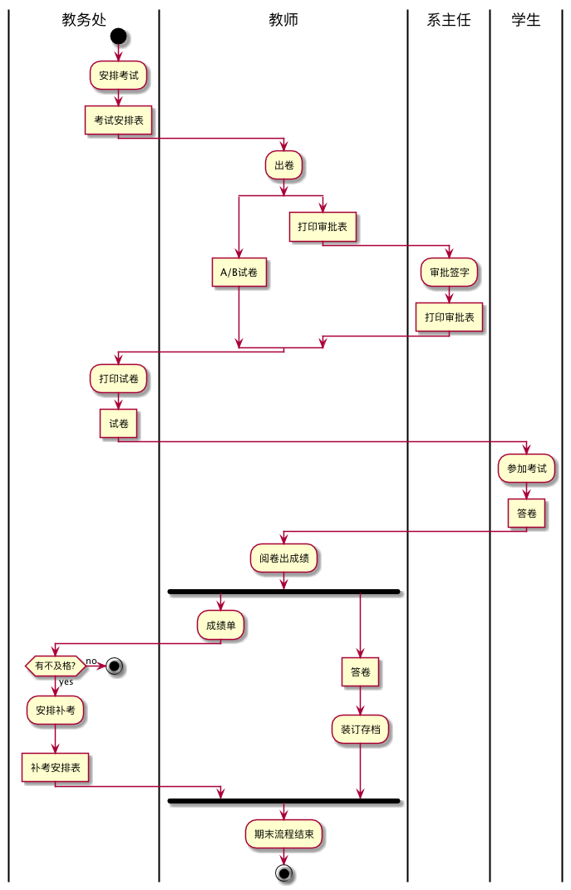

# 实验一：业务流程建模
|学号|班级|姓名|照片|
|:-:|:-:|:-:|:-:|
|20115110414226|软件工程2班|张嘉欣|ahhahah|
##流程图1：考试及成绩管理流程

###plantuml源码如下:
```
@startuml
|教务处|
start
:安排考试;
:考试安排表]
|教师|
:出卷;
split
:A/B试卷]
split again
:打印审批表]
|系主任|
:审批签字;
:打印审批表]
end split
|教务处|
:打印试卷;
:试卷]
|学生|
:参加考试;
:答卷]
|教师|
:阅卷出成绩;
fork
:成绩单;
|教务处|
if(有不及格?) then (yes)
:安排补考;
:补考安排表]
else(no)
stop
endif
fork again
|教师|
:答卷]
:装订存档;
end fork
|教师|
:期末流程结束;
stop
@enduml

```
###业务流程图如下:

###

##流程图2：客户维修服务流程

###plantuml源码如下:
```
@startuml
|客户|
start
:申请服务;
|业务经理|
if(是新客户吗？)then(yes)
:登记客户信息;
:上门勘察;
else(no)
:上门勘察;
endif
:制定方案;
|客户|
if(满意与否？)then(yes)
:签订合同;
|业务经理|
fork
:安排工人;
fork again
:安排材料;
end fork
:填写派工单;
|工人|
:领取材料;
:上门服务;
|客户|
:验收并填写反馈意见;
|业务经理|
:交回派工单;
|财务人员|
:结算收款;
stop
else(no)
|客户|
stop
endif
@enduml
```
###业务流程图如下:


