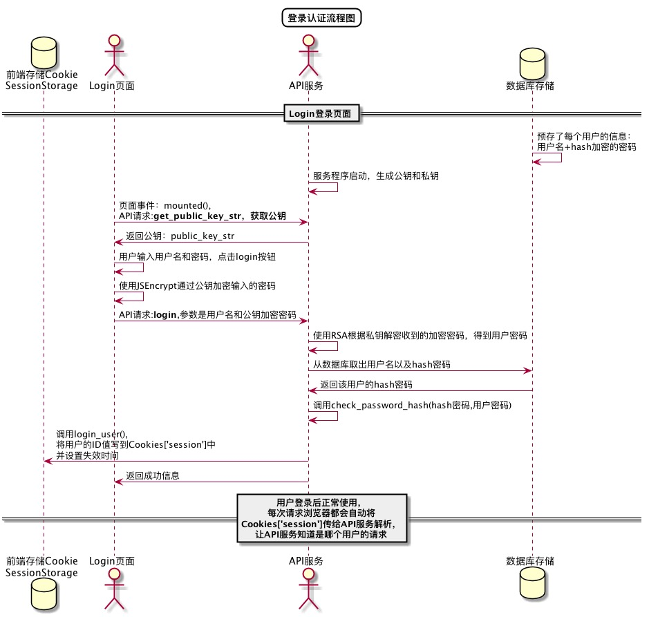

<!-- markdownlint-disable MD033-->
<!-- 禁止MD033类型的警告 https://www.npmjs.com/package/markdownlint -->

# “修改密码”用例 [返回](../README.md)
## 1. 用例规约

|用例名称|修改密码|
|-------|:-------------|
|功能|修改用户的密码|
|参与者|学生，老师|
|前置条件|必须先登录|
|后置条件|修改密码以后必须强制登出，再跳转到登录页面|
|主事件流| 1.用户需要输入老密码 2.老密码验证成功之后再输入新密码进行修改。|
|备选事件流|1.输入的两次新密码不同需重新输入 2.老密码要输入正确，不正确则返回到主页|

## 2. 业务流程
无

## 3. 界面设计
- 界面参照: 
- API接口调用
    - 接口1：[setPassword](../接口/setPassword.md)

## 4. 算法描述 [源码](../src/登录认证流程图.puml)

    
## 5. 参照表
users
- [USERS](../数据库设计.md/#USERS)
